# API_Library
<b>Autorzy: Natalia Skórowska, Aleksandra Okrój 
Tematyka API: Biblioteka  
Język: JavaScript  
Baza: MongoDB 
Struktura Projektu:</b> 
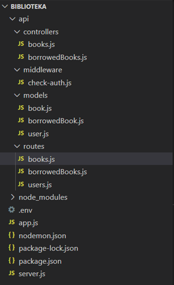 
<b>app.js</b> – import routów, połączenie z bazą, obsługa błędów  
 
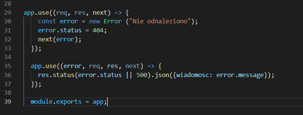 
<b>server.js</b> 
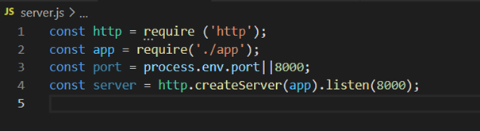 
<b>Controllers:</b>  
•	books.js – funkcje wyświetlenia listy książek, dodania nowej książki, wyświetlenia książki o konkretnym id, edytowania książki o konkretnym id, usunięcia książki o konkretnym id  
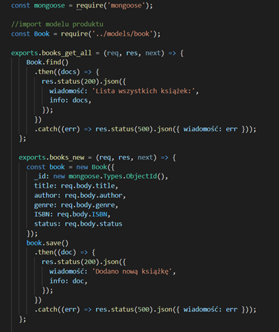 
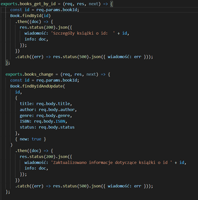 
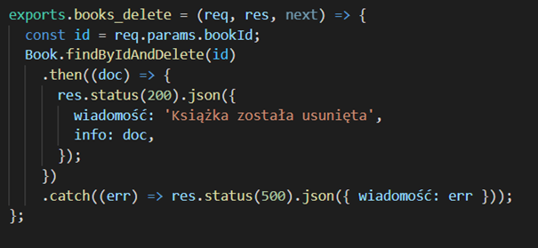 
•	borrowedBooks.js – funkcje wyświetlenia listy wypożyczeni, dodania nowego wypożyczenia, wyświetlenia wypożyczenia o konkretnym id, edytowania wypożyczenia o konkretnym id, usunięciu wypożyczenia o konkretnym id 
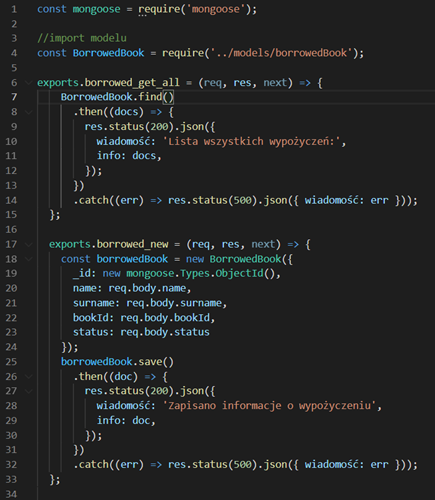 
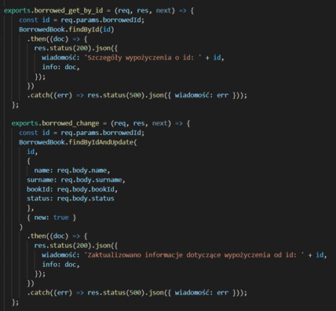 
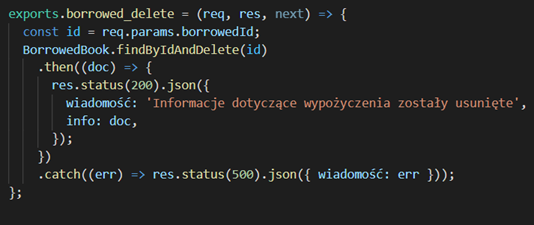 
<b>Middleware:</b> 
check-auth.js – uwierzytelnianie 
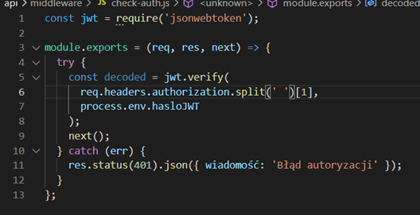 
<b>Models:</b> 
•	book.js  
 
•	borrowedBook.js  
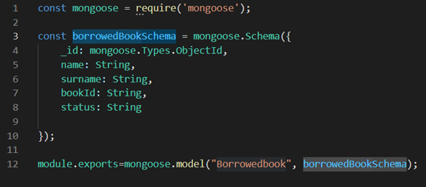 
•	user.js  
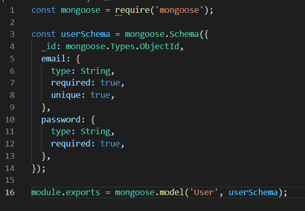 
<b>Routes:</b> 
•	books.js 
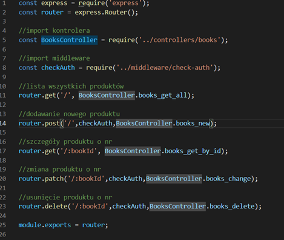 
•	borrowedBooks.js 
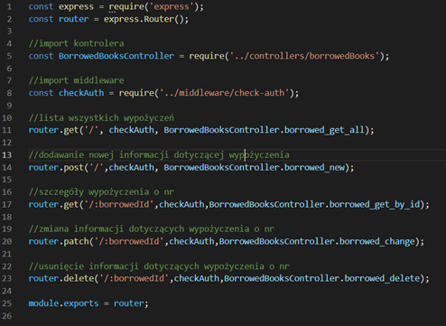 
•	users.js 
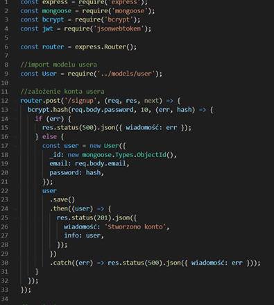 
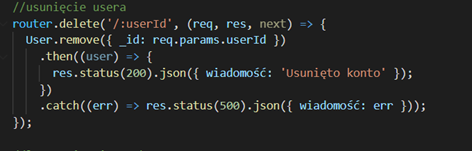 
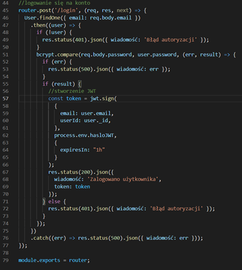 
<b>Efekty:</b>  
•	GET books/  
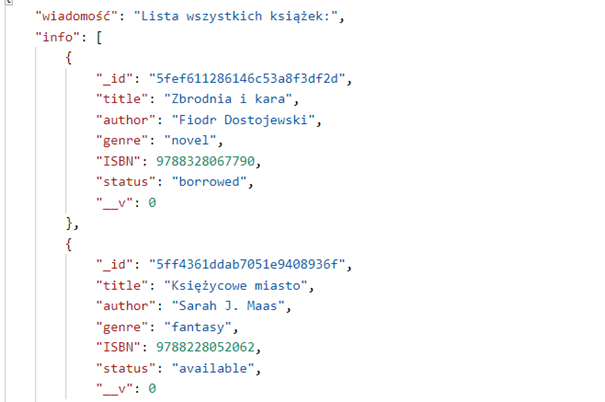 
•	GET books/:bookId 
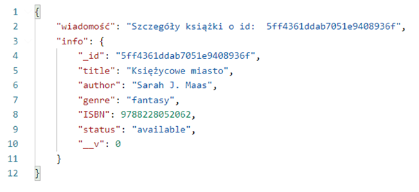 
•	POST books/ 
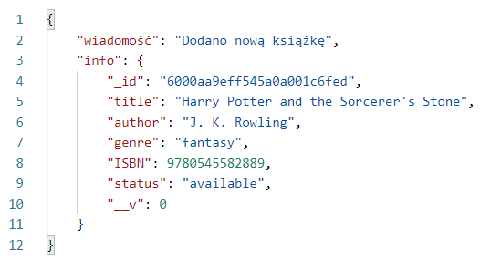 
•	PATCH books/:bookId 
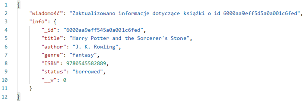 
•	DELETE books/:bookId  
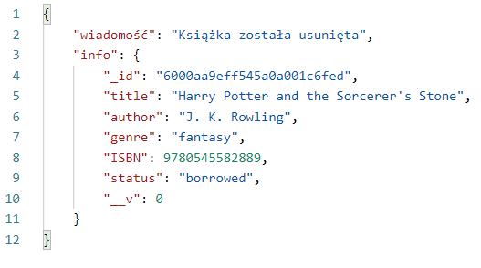 
•	GET borrowed/  
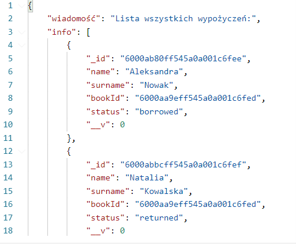 
•	GET borrowed/:borrowedId  
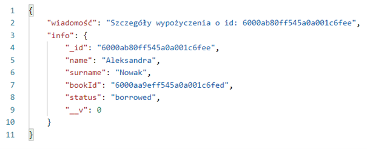 
•	POST borrowed/ 
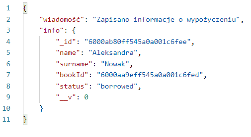 
•	PATCH borrowed/:borrowedId 
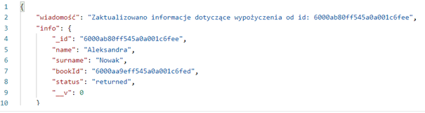 
•	DELETE borrowed/:borrowedId  
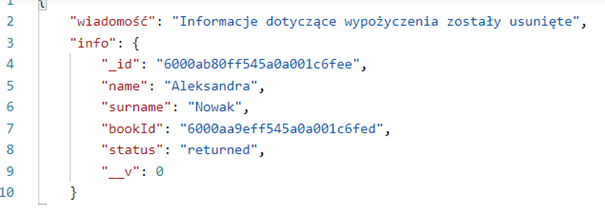 
•	POST users/signup  
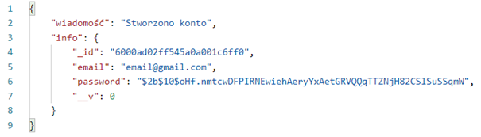 
•	POST users/login  
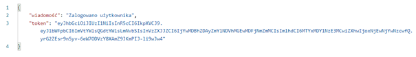 
•	DELETE users/:userId 
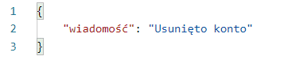 

